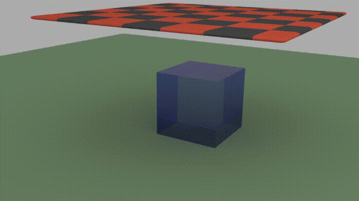
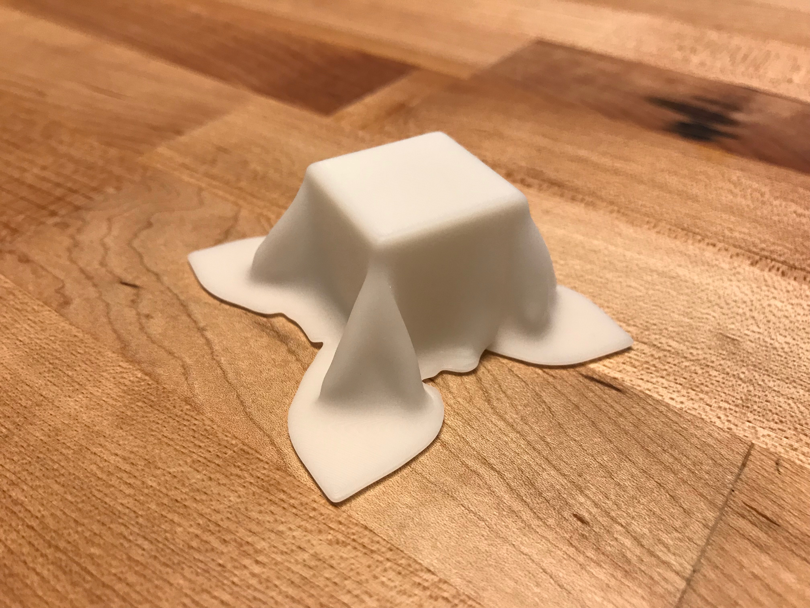

# 3D printed cloth curves

This begins with a cloth physics simulation in [Blender](https://www.blender.org/). You can experiment with the simulation yourself using [cloth.blend](cloth.blend) in this repo. Here's the result of the simulation (higher-resolution [available on Imgur](https://imgur.com/w7cfnq0)).

The 3D-printed drape comes from the final frame of this animation; Blender exports the shape as an STL file, [cloth.stl](cloth.stl), which we can then import into [PreForm](https://formlabs.com/tools/preform/). Here we prepare it for printing, adding supports and orienting the model (see [cloth.form](cloth.form)). I wanted to print fast, so I oriented the part close to level against the build platform in order to minimize layer count. This causes some layer lines to appear on horizontal surfaces, but if you were more patient you could orient the part at a steeper angle for better results.

I used a [Formlabs Form 2 SLA 3D printer](https://formlabs.com/3d-printers/form-2/) with [Rigid resin](https://formlabs.com/materials/engineering/#rigid-overview), a glass-filled material that offers extremely accurate prints with low creep and outstanding surface finish, even on thin parts. (Full disclosure: I work for Formlabs.) The printed result looks like this.

It's hard to photograph completely white objects, but the folded areas are incredibly smooth. The underside of the part includes a gratifying cavity where the cube would be; looking at it from below is sort of like staring through a completely invisible cube at a piece of cloth that's resting on it.

